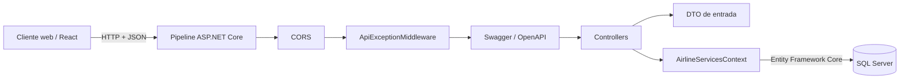
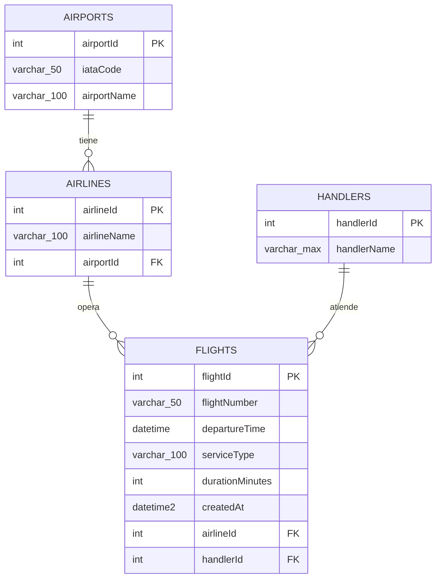

# Prueba Técnica Aerolínea — API de servicios aeroportuarios

API REST desarrollada con ASP.NET Core para consultar y registrar vuelos, junto con la aerolínea, el aeropuerto y el operador de asistencia en tierra (`Handler`) relacionados.

El proyecto utiliza Entity Framework Core con SQL Server y expone documentación interactiva mediante Swagger/OpenAPI.

## Contenido

- [Tecnologías](#tecnologías)
- [Arquitectura](#arquitectura)
- [Estructura del proyecto](#estructura-del-proyecto)
- [Base de datos](#base-de-datos)
- [Endpoints](#endpoints)
- [Swagger](#swagger)
- [CORS](#cors)
- [Middleware de excepciones](#middleware-de-excepciones)
- [Configuración y ejecución](#configuración-y-ejecución)
- [Pruebas manuales](#pruebas-manuales)
- [Comandos Git](#comandos-git)
- [Consideraciones para producción](#consideraciones-para-producción)

## Tecnologías

| Tecnología | Versión / uso |
|---|---|
| .NET | 10.0 |
| ASP.NET Core Web API | Controladores y pipeline HTTP |
| Entity Framework Core | 10.0.11 |
| SQL Server | Base de datos relacional |
| Swashbuckle.AspNetCore | 10.2.3, Swagger/OpenAPI |
| C# | Nullable reference types e implicit usings habilitados |

## Arquitectura

La solución utiliza una arquitectura sencilla por responsabilidades:



### Flujo de una solicitud

1. El cliente envía una solicitud HTTP.
2. La política CORS valida el origen de la solicitud.
3. `ApiExceptionMiddleware` intercepta determinadas excepciones producidas durante el procesamiento.
4. El controlador valida la ruta y ejecuta la operación solicitada.
5. `AirlineServicesContext` traduce las consultas LINQ a SQL.
6. SQL Server procesa la consulta.
7. La API devuelve una respuesta HTTP en formato JSON.

### Responsabilidades

- **Controllers:** reciben las solicitudes HTTP y construyen las respuestas.
- **Dto:** define los datos aceptados por las operaciones de escritura.
- **Models:** representa las tablas y relaciones de la base de datos.
- **Context:** configura Entity Framework Core, las entidades y sus relaciones.
- **Middleware:** centraliza el tratamiento de errores conocidos.
- **Program.cs:** registra dependencias y configura el pipeline HTTP.

## Estructura del proyecto

```text
airport_services_api/
├── airport_services_api.slnx
├── README.md
└── airport_services_api/
    ├── Context/
    │   └── AirlineServicesContext.cs
    ├── Controllers/
    │   └── FlightsController.cs
    ├── Dto/
    │   └── CreateFlightRequest.cs
    ├── Middleware/
    │   └── ApiExceptionMiddleware.cs
    ├── Models/
    │   ├── Airline.cs
    │   ├── Airport.cs
    │   ├── Flight.cs
    │   └── Handler.cs
    ├── Properties/
    │   └── launchSettings.json
    ├── appsettings.json
    ├── appsettings.Development.json
    ├── airport_services_api.csproj
    └── Program.cs
```

## Base de datos

El contexto apunta a una base SQL Server llamada `airline_services`. El modelo actual sigue un enfoque **Database First**: las clases y el `DbContext` reflejan una base existente. El repositorio no contiene migraciones de Entity Framework Core.

### Diagrama entidad-relación



> Los tipos y restricciones descritos a continuación se derivan del mapeo de `AirlineServicesContext`. Si la base cambia, se debe volver a generar o actualizar el modelo.

### Tabla `Airports`

Almacena los aeropuertos disponibles.

| Columna | Tipo aproximado | Restricción | Descripción |
|---|---|---|---|
| `airportId` | `int` | PK, generado al insertar | Identificador del aeropuerto |
| `iataCode` | `varchar(50)` | Requerido | Código IATA del aeropuerto |
| `airportName` | `varchar(100)` | Requerido | Nombre del aeropuerto |

### Tabla `Airlines`

Almacena las aerolíneas y el aeropuerto al que están asociadas.

| Columna | Tipo aproximado | Restricción | Descripción |
|---|---|---|---|
| `airlineId` | `int` | PK, generado al insertar | Identificador de la aerolínea |
| `airlineName` | `varchar(100)` | Requerido | Nombre de la aerolínea |
| `airportId` | `int` | FK → `Airports.airportId` | Aeropuerto asociado |

Relación: un aeropuerto puede tener muchas aerolíneas y cada aerolínea pertenece a un aeropuerto.

### Tabla `Handlers`

Almacena los operadores encargados de atender los vuelos.

| Columna | Tipo aproximado | Restricción | Descripción |
|---|---|---|---|
| `handlerId` | `int` | PK, generado al insertar | Identificador del operador |
| `handlerName` | `varchar(max)` | Requerido | Nombre del operador |

### Tabla `Flights`

Almacena los vuelos y relaciona cada registro con una aerolínea y un handler.

| Columna | Tipo aproximado | Restricción | Descripción |
|---|---|---|---|
| `flightId` | `int` | PK, generado al insertar | Identificador del vuelo |
| `flightNumber` | `varchar(50)` | Requerido | Número del vuelo |
| `DepartureTime` | `datetime` | Requerido | Fecha y hora de salida |
| `serviceType` | `varchar(100)` | Requerido | Tipo de servicio |
| `durationMinutes` | `int` | Requerido | Duración estimada en minutos |
| `createdAt` | `datetime2` | Requerido | Fecha de creación del registro |
| `airlineId` | `int` | FK → `Airlines.airlineId` | Aerolínea que opera el vuelo |
| `handlerId` | `int` | FK → `Handlers.handlerId` | Operador que atiende el vuelo |

Las relaciones no tienen eliminación en cascada configurada en el modelo. Primero deben resolverse los registros dependientes antes de eliminar un aeropuerto, aerolínea o handler relacionado.

### Script equivalente al modelo actual

Este script permite crear una estructura compatible con el modelo EF Core actual:

```sql
CREATE DATABASE airline_services;
GO

USE airline_services;
GO

CREATE TABLE dbo.Airports
(
    airportId   INT IDENTITY(1,1) NOT NULL PRIMARY KEY,
    iataCode    VARCHAR(50)       NOT NULL,
    airportName VARCHAR(100)      NOT NULL
);

CREATE TABLE dbo.Handlers
(
    handlerId   INT IDENTITY(1,1) NOT NULL PRIMARY KEY,
    handlerName VARCHAR(MAX)      NOT NULL
);

CREATE TABLE dbo.Airlines
(
    airlineId   INT IDENTITY(1,1) NOT NULL PRIMARY KEY,
    airlineName VARCHAR(100)      NOT NULL,
    airportId   INT               NOT NULL,
    CONSTRAINT FK_airport_id
        FOREIGN KEY (airportId) REFERENCES dbo.Airports(airportId)
);

CREATE TABLE dbo.Flights
(
    flightId        INT IDENTITY(1,1) NOT NULL PRIMARY KEY,
    flightNumber    VARCHAR(50)       NOT NULL,
    DepartureTime   DATETIME          NOT NULL,
    serviceType     VARCHAR(100)      NOT NULL,
    durationMinutes INT               NOT NULL,
    createdAt       DATETIME2         NOT NULL,
    airlineId       INT               NOT NULL,
    handlerId       INT               NOT NULL,
    CONSTRAINT FK_airline_id
        FOREIGN KEY (airlineId) REFERENCES dbo.Airlines(airlineId),
    CONSTRAINT FK_handler_id
        FOREIGN KEY (handlerId) REFERENCES dbo.Handlers(handlerId)
);
GO
```

Datos básicos de ejemplo:

```sql
INSERT INTO dbo.Airports (iataCode, airportName)
VALUES ('BOG', 'Aeropuerto Internacional El Dorado');

INSERT INTO dbo.Airlines (airlineName, airportId)
VALUES ('Aerolínea de ejemplo', 1);

INSERT INTO dbo.Handlers (handlerName)
VALUES ('Handler de ejemplo');
```

## Endpoints

La ruta base del controlador es `/Flights`.

| Método | Ruta | Descripción | Respuesta exitosa |
|---|---|---|---|
| `GET` | `/Flights` | Lista los vuelos con aerolínea, aeropuerto, código IATA y handler | `200 OK` |
| `GET` | `/Flights/{id}` | Obtiene un vuelo por ID | `200 OK` o `404 Not Found` |
| `POST` | `/Flights` | Registra un vuelo | `201 Created` |

### Listar vuelos

```http
GET /Flights HTTP/1.1
Host: localhost:5094
Accept: application/json
```

Respuesta aproximada:

```json
[
  {
    "flightId": 1,
    "flightNumber": "AV123",
    "departureTime": "2026-09-20T08:30:00",
    "serviceType": "Passenger",
    "durationMinutes": 90,
    "airline": "Aerolínea de ejemplo",
    "airport": "Aeropuerto Internacional El Dorado",
    "iataCode": "BOG",
    "handler": "Handler de ejemplo"
  }
]
```

La consulta utiliza `AsNoTracking()` porque es una operación de solo lectura y proyecta únicamente los campos requeridos.

### Consultar un vuelo

```http
GET /Flights/1 HTTP/1.1
Host: localhost:5094
Accept: application/json
```

### Crear un vuelo

```http
POST /Flights HTTP/1.1
Host: localhost:5094
Content-Type: application/json

{
  "flightNumber": "AV123",
  "departureTime": "2026-09-20T08:30:00",
  "serviceType": "Passenger",
  "durationMinutes": 90,
  "airlineId": 1,
  "handlerId": 1
}
```

El campo `createdAt` no se recibe desde el cliente: la API lo asigna con `DateTime.UtcNow`. Los valores `airlineId` y `handlerId` deben existir previamente en la base de datos.

Una creación correcta devuelve `201 Created` y una cabecera `Location` apuntando a `GET /Flights/{id}`.

## Swagger

Swagger está habilitado únicamente cuando la aplicación se ejecuta en el entorno `Development`.

Con el perfil HTTPS de `launchSettings.json`:

- Interfaz Swagger UI: `https://localhost:7250/swagger`
- Documento OpenAPI: `https://localhost:7250/swagger/v1/swagger.json`

Con el perfil HTTP:

- Interfaz Swagger UI: `http://localhost:5094/swagger`
- Documento OpenAPI: `http://localhost:5094/swagger/v1/swagger.json`

Swagger permite visualizar los endpoints, sus parámetros y modelos, además de enviar solicitudes directamente desde el navegador mediante **Try it out**.

## CORS

La política `ReactFrontend` se registra en `Program.cs`. Actualmente permite solicitudes desde cualquier origen, con cualquier encabezado y método HTTP:

```csharp
policy
    .AllowAnyOrigin()
    .AllowAnyHeader()
    .AllowAnyMethod();
```

Esta configuración facilita el desarrollo local del frontend. En producción se recomienda restringirla al dominio real:

```csharp
policy
    .WithOrigins("https://frontend.ejemplo.com")
    .AllowAnyHeader()
    .AllowAnyMethod();
```

No se debe combinar `AllowAnyOrigin()` con `AllowCredentials()`.

## Middleware de excepciones

`ApiExceptionMiddleware` centraliza la respuesta para dos excepciones conocidas:

| Excepción | Estado HTTP |
|---|---|
| `KeyNotFoundException` | `404 Not Found` |
| `ArgumentException` | `400 Bad Request` |

El middleware registra una advertencia en los logs y devuelve un objeto `ProblemDetails` como JSON. Ejemplo:

```json
{
  "title": "No se encontró el vuelo solicitado.",
  "status": 404
}
```

Las demás excepciones no son capturadas por este middleware en su implementación actual. Durante desarrollo, ASP.NET Core puede mostrarlas mediante su página de diagnóstico.

## Configuración y ejecución

### Requisitos

- .NET SDK 10.0.
- SQL Server o SQL Server Express.
- Una instancia con la base `airline_services` y las tablas descritas anteriormente.
- Git, si se desea clonar o contribuir al repositorio.

Verificar la instalación de .NET:

```powershell
dotnet --version
```

### 1. Clonar el repositorio

```powershell
git clone https://github.com/JonnathanMR/Prueba_Tecnica_Aerolinea.git
cd Prueba_Tecnica_Aerolinea
```

### 2. Configurar la conexión

Actualmente la conexión se configura en `Context/AirlineServicesContext.cs` mediante `OnConfiguring`:

```csharp
optionsBuilder.UseSqlServer(
    "Server=TU_SERVIDOR\\SQLEXPRESS;" +
    "Database=airline_services;" +
    "Integrated Security=True;" +
    "TrustServerCertificate=True;");
```

Reemplaza `TU_SERVIDOR` por el nombre de tu equipo o instancia SQL Server. La autenticación integrada usa la cuenta actual de Windows.

> Recomendación: antes de desplegar, mueve la cadena a configuración segura, variables de entorno o User Secrets. No publiques contraseñas en el repositorio.

### 3. Restaurar dependencias

```powershell
dotnet restore
```

### 4. Compilar

```powershell
dotnet build
```

### 5. Ejecutar

Desde la raíz del repositorio:

```powershell
dotnet run --project .\airport_services_api\airport_services_api.csproj
```

También se puede iniciar desde Visual Studio seleccionando el perfil `https`.

Si el certificado HTTPS de desarrollo no es confiable:

```powershell
dotnet dev-certs https --trust
```

## Pruebas manuales

### PowerShell

Listar vuelos:

```powershell
Invoke-RestMethod -Uri "https://localhost:7250/Flights" -Method Get
```

Crear un vuelo:

```powershell
$body = @{
    flightNumber    = "AV123"
    departureTime   = "2026-09-20T08:30:00"
    serviceType     = "Passenger"
    durationMinutes = 90
    airlineId       = 1
    handlerId       = 1
} | ConvertTo-Json

Invoke-RestMethod `
    -Uri "https://localhost:7250/Flights" `
    -Method Post `
    -ContentType "application/json" `
    -Body $body
```

### Archivo `.http`

Visual Studio permite enviar solicitudes desde archivos `.http`. Se puede actualizar `airport_services_api.http` con las rutas anteriores y seleccionar **Send Request** sobre cada solicitud.

## Comandos Git

Flujo básico para publicar cambios:

```powershell
git status
git add .
git commit -m "Describe el cambio realizado"
git push
```

Antes de empezar una nueva tarea:

```powershell
git pull
```

## Consideraciones para producción

Antes de llevar la API a producción se recomienda:

- Mover la cadena de conexión fuera de `AirlineServicesContext`.
- Restringir CORS al dominio autorizado.
- Agregar validaciones al DTO `CreateFlightRequest`.
- Implementar autenticación y autorización si los endpoints no serán públicos.
- Capturar y registrar de forma segura las excepciones inesperadas.
- Incorporar pruebas unitarias y de integración.
- Agregar paginación y filtros al listado de vuelos.
- Versionar la base de datos mediante migraciones o scripts SQL controlados.
- Eliminar los archivos de ejemplo `WeatherForecast` que no formen parte del dominio final.

## Estado de compilación

El proyecto fue validado con:

```powershell
dotnet build --no-restore
```

Resultado al documentarlo: compilación correcta, sin advertencias ni errores.
